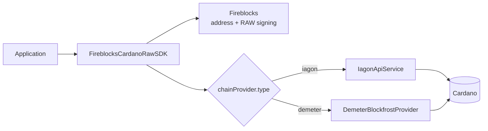

<div align="center">

# Fireblocks Cardano Raw SDK

**Build and sign Cardano transactions with Fireblocks, then choose IAGON or
Demeter for Cardano chain access.**

[](https://github.com/blinklabs-io/fireblocks-cardano-raw-sdk/actions/workflows/ci.yml)
[](package.json)
[](#provider-wiring)

[Runnable Demeter POC](https://github.com/verbotenj/cardano-raw-sdk-demeter-poc) ·
[Security policy](SECURITY.md) · [Generated API reference](docs/index.html)

</div>

> [!WARNING]
> This repository is a proof-of-concept fork, not an audited production custody
> product. Fireblocks RAW signing can authorize arbitrary payloads and is
> disabled by default in production workspaces. Configure Fireblocks policies,
> use testnet first, and read [Security](#security) before deploying anything.

## What changed in this fork

The original SDK talked directly to IAGON. This fork introduces a small
`CardanoDataProvider` contract so the core transfer path can use either:

- `IagonApiService`, preserving the original broad feature set; or
- `DemeterBlockfrostProvider`, providing the complete ADA-transfer data path
  through Demeter's Blockfrost-compatible API.

Fireblocks and the chain provider have different jobs. Fireblocks protects the
key and applies signing policy. IAGON or Demeter reads Cardano state and submits
the already-signed transaction. Cardano is the final settlement record.

## Provider wiring



The shared core contract covers provider health, address balance, UTxOs,
current slot, binary transaction submission, and confirmation by hash. The SDK
checks provider capabilities before invoking an extended operation.

### Verified transfer-boundary checks

Demeter wallet scans are bounded, reject duplicate outputs and malformed asset
units, and fail if a later page disappears. Authenticated requests do not follow
redirects. Transient reads have bounded retries; transaction POSTs are not blindly
retried. The shared submission helper checks the returned hash against the local
body hash. An ambiguous submission is reconciled only if that exact hash is
already visible on-chain; otherwise it reports an unknown outcome.

`getTransactionDetails()` remains a lightweight polling lookup (`utxosComplete:
false` for Demeter). `getFullTransactionDetails()` additionally fetches actual
inputs/outputs, preserving reference/collateral flags and failing on unavailable
UTxO data. It is a separate optional provider operation, not general history support.

Demeter SDK ADA, CNT, multi-token and consolidation paths now fetch a fresh
network-bound protocol snapshot for each build. Fees, output-byte cost and maximum
transaction size use that snapshot. Direct builder callers must pass
`protocolParameters` to opt in; omission retains legacy IAGON constants. Snapshots
expire after five minutes. Fee sizing still conservatively estimates key-witness
overhead; this is not a Plutus execution-cost estimator. Staking/governance builders
and the legacy standalone `calculateTransactionFee()` utility are not migrated.

Local regressions live in `src/__tests__/services/demeter-safety.test.ts` and
`src/__tests__/utils/transfer-verification.test.ts`. Live Preview acceptance logs
are maintained in the companion POC's `proofs/qa-compatibility/` directory.

### Indexed reads: history, assets, accounts and pools

`sdk.getChainQueries()` exposes the same narrow read interface for either selected
provider. Standalone applications can use `provider.queries` without initializing
Fireblocks. This does not change the old IAGON-specific SDK methods or enable
Demeter staking/governance transactions.

```typescript
const reads = sdk.getChainQueries(); // after SDK initialization
const page = await reads.addressHistory(address, { count: 10, details: "full" });
const asset = await reads.assetDetails(policyId + assetNameHex);
const account = await reads.stakeAccount(stakeAddress);
const addresses = await reads.stakeAddresses(stakeAddress, { page: 1, count: 25 });
const rewards = await reads.stakeRewards(stakeAddress, { page: 1, count: 25 });
const metadata = await reads.poolMetadata(poolId);
const delegators = await reads.poolDelegators(poolId, { page: 1, count: 25 });
```

- `supportedOperations` lists individual implemented read operations, not a
  guarantee that every deployment implements them. A Demeter HTTP 501 becomes
  `ChainReadUnsupportedError` and is not retried.
- Pages use `page`/`count`; count is 1–100 and page is 1–1000. Full-history pages
  are limited to 25 and hydrate transactions sequentially. A missing or
  inconsistent transaction fails the page, not a partial success.
- Demeter history is newest-first. Other list ordering is provider-defined.
  Demeter totals are `null`; `nextPage` on a full page is a continuation to try,
  not proof of more results. `collectChainPages()` provides bounded collection
  with duplicate detection. Empty/short pages do not prove complete archive retention.
- `fromBlock`/`toBlock` are **block heights**, supported only by the Demeter
  query adapter. A `fromSlot` property is rejected rather than silently reinterpreted;
  IAGON's existing slot-based history API remains separate.
- Supply/reward/stake amounts are decimal strings. Combined mint/burn counts
  are not split, controlled ADA is not called active stake, and unknown
  registration/epoch/metadata fields stay `null`. Metadata is untrusted data;
  escape it when displaying it and do not automatically follow its URLs.

This covers paged per-address history, basic asset information, account/reward
reads and individual pool metadata/delegators. It does not add vault-wide history,
credential ownership inference, rich webhook metadata enrichment, account asset
aggregation, registration/delegation history, pool aggregates/validation, or
staking/governance writes. Both provider adapters have local HTTP contract tests;
live acceptance is Demeter Preview only, not live IAGON or Fireblocks.

## Installation

Node.js 20 or newer is required.

```bash
git clone https://github.com/blinklabs-io/fireblocks-cardano-raw-sdk.git
cd fireblocks-cardano-raw-sdk
npm ci
npm run quality
```

This fork is not published to npm. An application can pin an immutable HTTPS
archive. The repository tracks compiled `dist/` files so archive installation
does not execute build tools:

```json
{
  "dependencies": {
    "cardano-raw-sdk": "https://github.com/blinklabs-io/fireblocks-cardano-raw-sdk/archive/COMMIT_SHA.tar.gz"
  }
}
```

Import all public values and types from the package root:

```ts
import {
  FireblocksCardanoRawSDK,
  Networks,
  ProviderCapabilityError,
  SdkApiError,
} from "cardano-raw-sdk";
import { BasePath } from "@fireblocks/ts-sdk";
```

Do not import `cardano-raw-sdk/types`; that subpath is not exported.

## Create an SDK instance

### Demeter

```ts
import { FireblocksCardanoRawSDK, Networks } from "cardano-raw-sdk";
import { BasePath } from "@fireblocks/ts-sdk";

const sdk = await FireblocksCardanoRawSDK.createInstance({
  fireblocksConfig: {
    apiKey: process.env.FIREBLOCKS_API_USER_KEY!,
    secretKey: process.env.FIREBLOCKS_API_USER_SECRET_KEY!,
    basePath: BasePath.US,
  },
  vaultAccountId: process.env.FIREBLOCKS_VAULT_ACCOUNT_ID!,
  network: Networks.PREVIEW,
  chainProvider: {
    type: "demeter",
    baseUrl: process.env.DEMETER_BLOCKFROST_URL!,
    apiKey: process.env.DEMETER_API_KEY!,
  },
});

await sdk.checkProviderHealth();
```

The tested Demeter resource authenticates with `dmtr-api-key`; the provider adds
that header and sends signed transaction bytes as `application/cbor`. Use the
URL and authentication instructions shown for your own Demeter resource rather
than assuming every Demeter product has the same endpoint shape.

### IAGON

```ts
const sdk = await FireblocksCardanoRawSDK.createInstance({
  fireblocksConfig,
  vaultAccountId: "0",
  network: Networks.MAINNET,
  chainProvider: {
    type: "iagon",
    apiKey: process.env.IAGON_API_KEY!,
  },
});
```

The deprecated `iagonApiKey` initialization field is retained for source
compatibility. New integrations should use `chainProvider` explicitly.

## Verified provider coverage

“Supported” means the implementation and automated tests exist. “Live proof”
means the companion POC contains a confirmed Cardano Preview receipt. It does
not mean every method has been independently security-audited.

| Capability                                                       | IAGON     | Demeter                                    |
| ---------------------------------------------------------------- | --------- | ------------------------------------------ |
| Provider health                                                  | Supported | Supported; live-read proof                 |
| Address balance and policy grouping                              | Supported | Supported; live-read proof                 |
| UTxO lookup and multi-asset normalization                        | Supported | Supported; live-read proof                 |
| Current slot                                                     | Supported | Supported; live-read proof                 |
| ADA transaction build, fee calculation, submission, confirmation | Supported | Supported; confirmed Preview proof         |
| Native-token build and submission core                           | Supported | Implemented; no committed live CNT receipt |
| Address/credential history                                       | Supported | Not implemented                            |
| Staking and Cardano protocol governance                          | Supported | Not implemented                            |
| Pool and asset-metadata queries                                  | Supported | Not implemented                            |

An unavailable Demeter operation throws `ProviderCapabilityError`; it never
silently switches to IAGON. The complete claim/evidence matrix is maintained in
the [POC compatibility audit](https://github.com/verbotenj/cardano-raw-sdk-demeter-poc/blob/main/docs/DEMETER_README_COMPATIBILITY.md).

## ADA transfer

`transferAda()` obtains the Fireblocks address, reads UTxOs through the selected
provider, builds a Cardano body, requests RAW signing, verifies and assembles the
witness, submits the signed CBOR through that same provider, and checks the
returned transaction hash.

```ts
const result = await sdk.transferAda({
  recipientAddress: "addr_test1...",
  lovelaceAmount: 2_000_000,
});

console.log(result.txHash);
```

`2_000_000` lovelace equals 2 ADA. Validate the exact option shape against the
generated API reference for the revision you pinned.

### Governed transfer

For institutional workflows, the optional governance contract correlates:

1. locally decoded inputs, outputs, change, assets, fee, and recipient;
2. the exact Cardano transaction-body hash sent to Fireblocks;
3. Fireblocks `externalTxId`, approval groups, and designated signer evidence;
4. the returned Ed25519 signature and source payment key;
5. the transaction hash returned by Demeter; and
6. the transaction confirmed by Cardano.

The automated suite verifies these invariants and rejection cases. The public
POC does **not** claim a live Fireblocks approval receipt because no Fireblocks
credentials were used for its committed Preview transaction.

## Error handling

SDK errors expose `statusCode`, `errorType`, `errorInfo`, and `service`.

```ts
try {
  await sdk.transferAda(options);
} catch (error) {
  if (error instanceof ProviderCapabilityError) {
    console.error(`Provider ${error.provider} lacks ${error.capability}`);
  } else if (error instanceof SdkApiError) {
    if (error.errorType === "InsufficientBalance") {
      console.error("The selected address does not have enough spendable ADA");
    }
    console.error(error.statusCode, error.errorType);
  } else {
    throw error;
  }
}
```

## Optional REST server

The package can also run a privileged operator API. Library users do not need
this server. Its transfer routes can request signatures and spend assets, so it
is secured and local-only by default.

Create a private environment file:

```bash
cp .env.example .env.development
openssl rand -hex 32
```

Place the generated value in `SERVER_API_KEY`, configure Fireblocks and one
chain provider, then build and start:

```bash
npm run build
npm start
```

The default listener is `127.0.0.1:8000`. All `/api` routes except the signed
Fireblocks webhook require either:

```text
Authorization: Bearer <SERVER_API_KEY>
```

or:

```text
x-api-key: <SERVER_API_KEY>
```

`GET /health` is the only unauthenticated health endpoint and returns only
`Alive`. `POST /api/webhook` instead requires a valid Fireblocks JWKS or legacy
signature, verified before processing. API documentation at `/api-docs`,
`/api-docs-json`, and `/docs` also requires the server key.

The server additionally applies security headers, request-size limits, request
timeouts, and IP rate limiting. If you explicitly bind beyond loopback, put it
behind authenticated TLS and a firewall. Set `TRUST_PROXY=true` only behind one
trusted proxy that overwrites forwarded headers.

### Docker

The repository supplies a hardened multi-stage `Dockerfile`; it does not supply
Docker Compose configuration.

```bash
docker build -t cardano-raw-sdk .
docker run --rm \
  --env-file .env.development \
  -p 127.0.0.1:8000:8000 \
  -e SERVER_HOST=0.0.0.0 \
  cardano-raw-sdk
```

Binding the container process to `0.0.0.0` is necessary for the host mapping;
the host-side mapping above remains loopback-only.

## Configuration

| Variable                                    | Required               | Purpose                                                         |
| ------------------------------------------- | ---------------------- | --------------------------------------------------------------- |
| `FIREBLOCKS_API_USER_KEY`                   | Server/Fireblocks mode | Fireblocks API user ID                                          |
| `FIREBLOCKS_API_USER_SECRET_KEY` or `_PATH` | Server/Fireblocks mode | PEM content or private file path                                |
| `FIREBLOCKS_BASE_PATH`                      | No                     | Fireblocks API region; defaults to US                           |
| `FIREBLOCKS_VAULT_ACCOUNT_ID`               | Application-specific   | Source vault account                                            |
| `CARDANO_NETWORK`                           | No                     | `mainnet`, `preprod`, or `preview`; server default is `mainnet` |
| `CHAIN_PROVIDER`                            | Server                 | `iagon` or `demeter`; server default is `demeter`               |
| `IAGON_API_KEY`                             | IAGON                  | IAGON bearer credential                                         |
| `DEMETER_BLOCKFROST_URL`                    | Demeter                | Exact resource base URL                                         |
| `DEMETER_API_KEY`                           | Demeter                | Resource credential                                             |
| `SERVER_API_KEY`                            | REST server            | At least 32 random bytes                                        |
| `SERVER_HOST`                               | No                     | Listener address; defaults to `127.0.0.1`                       |
| `REQUEST_BODY_LIMIT`                        | No                     | Express request limit; defaults to `256kb`                      |
| `RATE_LIMIT_WINDOW_MS`                      | No                     | Rate-limit window; defaults to 60 seconds                       |
| `RATE_LIMIT_MAX`                            | No                     | Requests per IP/window; defaults to 100                         |
| `TRUST_PROXY`                               | No                     | Trust exactly one proxy only when set to `true`                 |
| `NODE_ENV`                                  | No                     | Defaults to `production` behavior                               |

Keep secrets in an ignored local file or a secret manager. Never commit `.env`
files, mnemonics, PEM material, API keys, full signed CBOR, or unredacted
Fireblocks responses.

## Network safety

| Network | SDK enum           | Fireblocks asset | Network magic |
| ------- | ------------------ | ---------------- | ------------- |
| Mainnet | `Networks.MAINNET` | `ADA`            | `764824073`   |
| Preprod | `Networks.PREPROD` | `ADA_TEST`       | `1`           |
| Preview | `Networks.PREVIEW` | `ADA_TEST`       | `2`           |

The live GitHub workflows default to Preview, use per-network GitHub
environments, and require the exact phrase
`I_UNDERSTAND_THIS_USES_REAL_FUNDS` before mainnet. Protect the
`cardano-mainnet` environment with required reviewers before adding secrets.

## Security

- Treat Fireblocks RAW signing as arbitrary-message signing. Constrain API
  users, vaults, assets, derivation paths, destinations, amounts, and approval
  groups with Fireblocks policy.
- Use distinct credentials and vaults for Preview, Preprod, and Mainnet.
- Do not accept a caller-supplied provider URL in a request; provider endpoints
  are trusted startup configuration.
- TLS certificate verification is mandatory for IAGON requests, including in
  development. The legacy `disableSslVerification` option now throws if enabled.
- Review the decoded transaction before signing. A provider supplies untrusted
  chain data and must never decide the business intent.
- Correlate `externalTxId`, Fireblocks transaction ID, transaction-body hash,
  signer evidence, submitted hash, and confirmed hash for governed transfers.
- Rotate provider and server credentials, use least privilege, and retain
  sanitized audit logs.
- Run `npm run quality` and review dependency alerts before merging.

See [SECURITY.md](SECURITY.md) for disclosure and deployment rules.

## Verification

```bash
npm run format:check
npm run lint
npm run typecheck
npm test -- --runInBand
npm run build
npm run audit:prod
npm run docs
```

`npm run quality` runs every gate, regenerates `dist/` and the API reference,
and fails if either committed artifact is stale. CI repeats the same
non-destructive checks; it never receives wallet or provider secrets.
Live workflows are separate, manually dispatched, and environment-scoped.

The companion [Demeter POC](https://github.com/verbotenj/cardano-raw-sdk-demeter-poc)
contains beginner instructions, sanitized logs, a confirmed Preview receipt,
tamper tests, and a read-only command that rechecks the receipt through Demeter.

## Evidence boundaries

Cardano proves that transaction bytes were accepted and included in a block. It
does not record the SDK name or gateway that submitted them. SDK and Demeter
provenance therefore comes from the pinned dependency, source path, sanitized
execution log, returned hash, and reproducible provider lookup. Stronger
provider attribution requires correlated Demeter control-plane request records.

## License

The upstream repository and this fork currently contain no license grant.
`package.json` is therefore marked `UNLICENSED`. Public visibility is not a
license to use, modify, or redistribute the code. Obtain permission from the
rights holder before using it beyond evaluation, or add an approved license in
a separately reviewed legal change.
